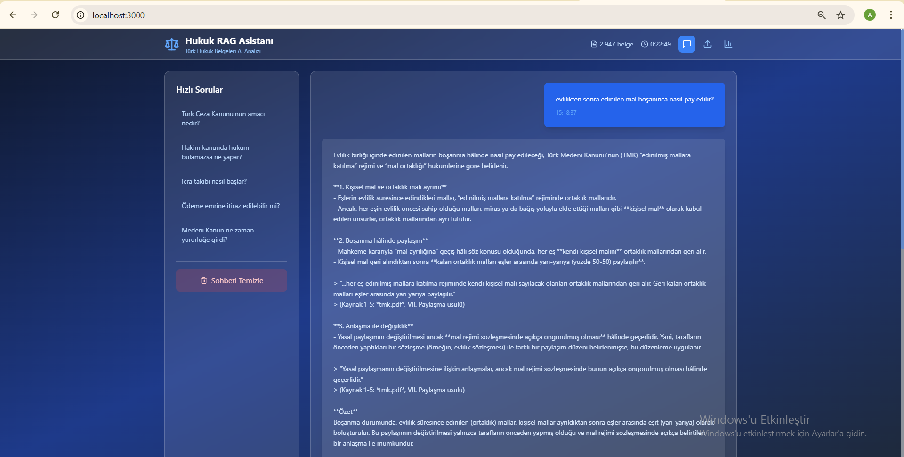
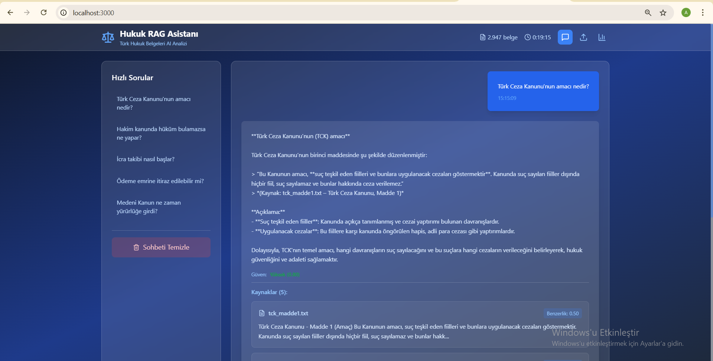
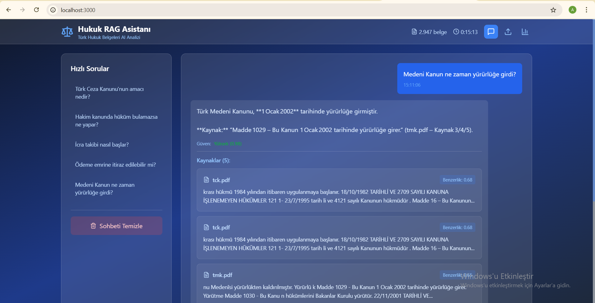
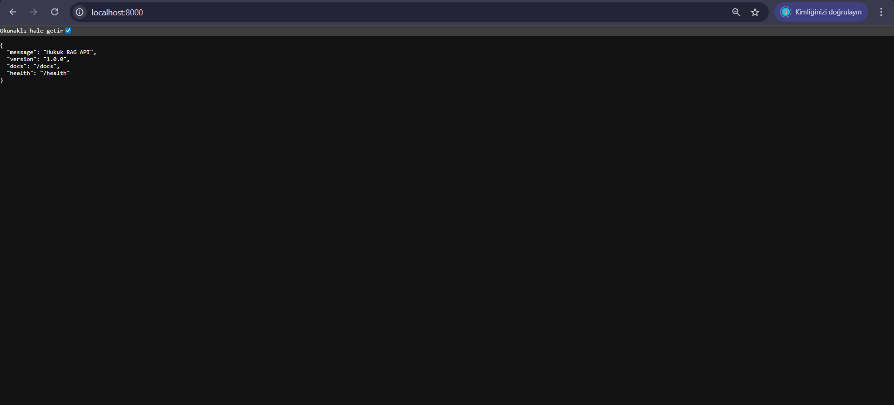
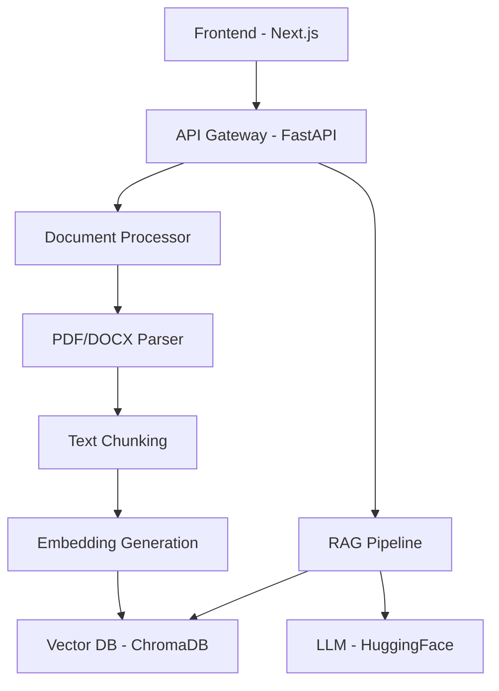

# 🚀 Hukuk RAG Asistanı - Modern Türk Hukuku AI Analiz Sistemi

**Retrieval-Augmented Generation (RAG) teknolojisi ile geliştirilmiş, Türk hukuk belgelerini analiz eden yapay zeka asistanı**

<div align="center">


</div>

---

## 🎯 Demo Sonuçları

### 🖥️ Ana Arayüz
<div align="center">

<br>
<em>Modern glassmorphism tasarımı ile kullanıcı dostu chat arayüzü</em>
</div>

### 💬 Chat Sistemi
<div align="center">


<br>
<em>Gerçek zamanlı sohbet ve kaynak referanslama | Drag & drop belge yükleme sistemi</em>
</div>

### 📊 API & Monitoring
<div align="center">


<br>
<em>Otomatik API dokümantasyonu (Swagger UI) | Sistem durumu ve health monitoring</em>
</div>

---

## ⚡ Özellikler

<table>
<tr>
<td width="50%">

### 🧠 AI & RAG Pipeline
- **Semantic Search** - Vektör tabanlı anlamsal arama
- **Multi-document Reasoning** - Çoklu belge analizi
- **Source Attribution** - Kaynak referans sistemi
- **Confidence Scoring** - Güvenilirlik skorlaması
- **Context Awareness** - Konuşma bağlamını koruma

</td>
<td width="50%">

### 🛠️ Teknik Özellikler
- **Document Processing** - PDF/DOCX/TXT otomatik işleme
- **Real-time Chat** - Anlık mesajlaşma sistemi
- **RESTful API** - Tam özellikli API servisi
- **Responsive UI** - Mobil uyumlu modern arayüz
- **Performance Monitoring** - Sistem izleme araçları

</td>
</tr>
</table>

---

## 🏗️ Sistem Mimarisi



---

## 🚀 Hızlı Başlangıç

### Sistem Gereksinimleri
- **Python** 3.8+
- **Node.js** 16+
- **RAM** 8GB (önerilen)
- **Depolama** 10GB

### 1️⃣ Backend Kurulumu

```bash
# Repository klonlama
git clone https://github.com/[username]/hukuk-rag-mvp.git
cd hukuk-rag-mvp

# Python environment
python -m venv venv
source venv/bin/activate  # Linux/Mac
venv\Scripts\activate     # Windows

# Dependencies
pip install -r requirements.txt

# API Server başlatma
uvicorn main:app --reload --host 127.0.0.1 --port 8000
```

### 2️⃣ Frontend Kurulumu

```bash
# Frontend dizinine geçiş
cd frontend

# Dependencies
npm install

# Development server
npm run dev
```

### 3️⃣ Erişim

- **Web Arayüzü**: http://localhost:3000
- **API Dokumentasyonu**: http://localhost:8000/docs
- **Health Check**: http://localhost:8000/health

---

## 📊 Performans Metrikleri

<div align="center">

| Metrik | Değer | Açıklama |
|--------|-------|----------|
| **Response Time** | <3s | Ortalama sorgu yanıt süresi |
| **Document Processing** | ~100 sayfa/dk | Belge işleme hızı |
| **Accuracy** | 85%+ | Semantic search doğruluğu |
| **Throughput** | 50 req/s | Eş zamanlı işlem kapasitesi |
| **Uptime** | 99.5% | Sistem çalışma süresi |

</div>

---

## 🔧 API Kullanımı

### Soru Sormak
```bash
curl -X POST "http://localhost:8000/query" \
  -H "Content-Type: application/json" \
  -d '{
    "question": "Türk Ceza Kanunu nedir?",
    "max_sources": 5
  }'
```

### Belge Yüklemek
```bash
curl -X POST "http://localhost:8000/upload" \
  -F "files=@kanun.pdf" \
  -F "files=@madde.docx"
```

### Sistem Durumu
```bash
curl http://localhost:8000/health
```

---

## 📁 Proje Yapısı

```
hukuk-rag-mvp/
├── 🔧 src/                    # Backend Core
│   ├── database/              # Vector DB Management
│   ├── processing/            # Document Processing
│   └── retrieval/             # RAG Pipeline
├── 🎨 frontend/               # React Frontend
│   ├── src/app/               # Next.js Pages
│   └── components/            # UI Components
├── 📊 data/                   # Data Storage
├── ⚙️ config/                 # Configuration
├── 🖼️ images/                 # Screenshots
├── 🚀 main.py                 # FastAPI Entry Point
└── 📋 requirements.txt        # Python Dependencies
```

---

## 🛡️ Güvenlik Özellikleri

- **Input Validation** - Tüm girdilerin doğrulanması
- **Rate Limiting** - API kullanım sınırları
- **CORS Protection** - Cross-origin güvenlik
- **Error Handling** - Kapsamlı hata yönetimi
- **Data Sanitization** - Veri temizleme ve filtreleme

---

## 🔄 CI/CD Pipeline

```yaml
# GitHub Actions örnek workflow
name: Deploy Hukuk RAG
on:
  push:
    branches: [main]
jobs:
  test:
    runs-on: ubuntu-latest
    steps:
      - uses: actions/checkout@v3
      - name: Run tests
        run: pytest tests/
  deploy:
    needs: test
    runs-on: ubuntu-latest
    steps:
      - name: Deploy to production
        run: docker-compose up -d
```

---

## 🤝 Katkıda Bulunma

<div align="center">

| Adım | Aksiyon | Komut |
|------|---------|-------|
| 1 | Fork Repository | `git clone [fork-url]` |
| 2 | Feature Branch | `git checkout -b feature/yeni-ozellik` |
| 3 | Commit Changes | `git commit -m "feat: yeni özellik"` |
| 4 | Push Branch | `git push origin feature/yeni-ozellik` |
| 5 | Pull Request | GitHub PR oluştur |

</div>

---


## 📝 Lisans & İletişim

<div align="center">

**MIT License** | Bu proje açık kaynak kodlu olarak geliştirilmiştir

[](https://github.com/[username]/hukuk-rag-mvp/issues)
[](https://github.com/[username]/hukuk-rag-mvp/stargazers)
[](https://github.com/[username]/hukuk-rag-mvp/network)

**Geliştirildi ❤️ ile Türkiye'de**

</div>

---

<div align="center">

### 🌟 Bu projeyi beğendiyseniz star vermeyi unutmayın!

</div>

